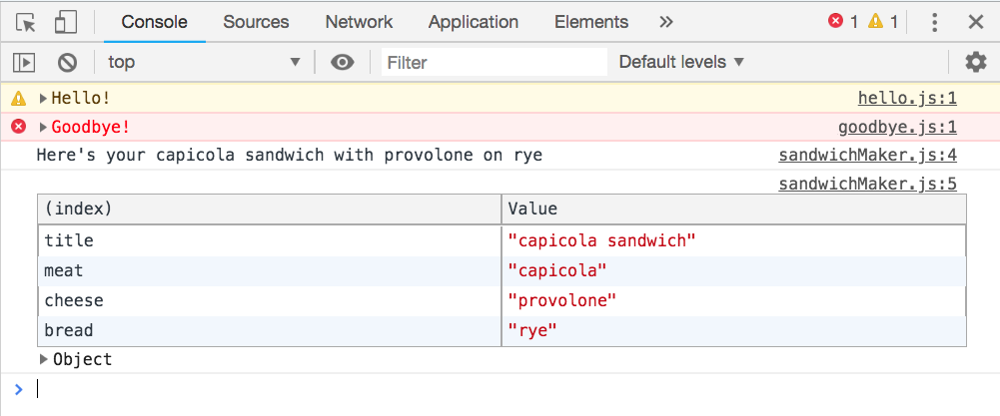

# Browserify Boilerplate Repository

Use this repository for when you want to start a new modular JavaScript application that gets compiled by Browserify. You start off with three JavaScript modules in the `src/scripts` directory.

1. `hello.js` - Exports a simple function that says hello
1. `goodbye.js` - Exports a simple function that says goodbye
1. `sandwichMaker.js` - Exports an object with a single method named `placeOrder()`
1. `main.js` - Contains the logic of your application. It imports the other three modules, and invokes all of the functions.

## Setup

1. Clone this repository.
1. `cd browserify-boilerplate/src/lib`
1. `npm install`
1. `grunt`

The web server will be started, and the JavaScript code in the `src/scripts` directory will be compiled into `public/hellogoodbye.js`.

1. Open Chome and make sure your developer tools are open.
1. Open [http://localhost:8080](http://localhost:8080) in your browser.
1. You should see the following output in the console.

